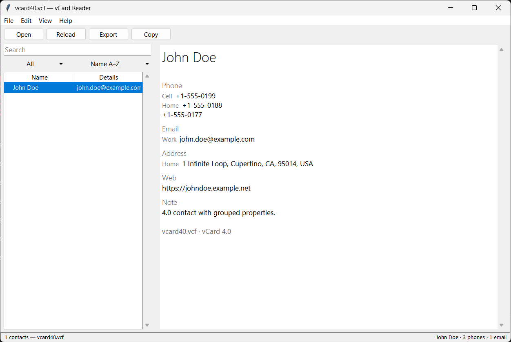

# vcard-reader-tk

Simple two-pane vCard (.vcf) reader in Python and tkinter. List on the left,
details on the right. Stdlib only.

## Run

```text
python vcard_reader.py [file.vcf]
```

You can also drop `.vcf` files or folders onto the window.



## Test

```text
python -m unittest discover
```

## License

Licensed under the MIT License — see [LICENSE](LICENSE).
